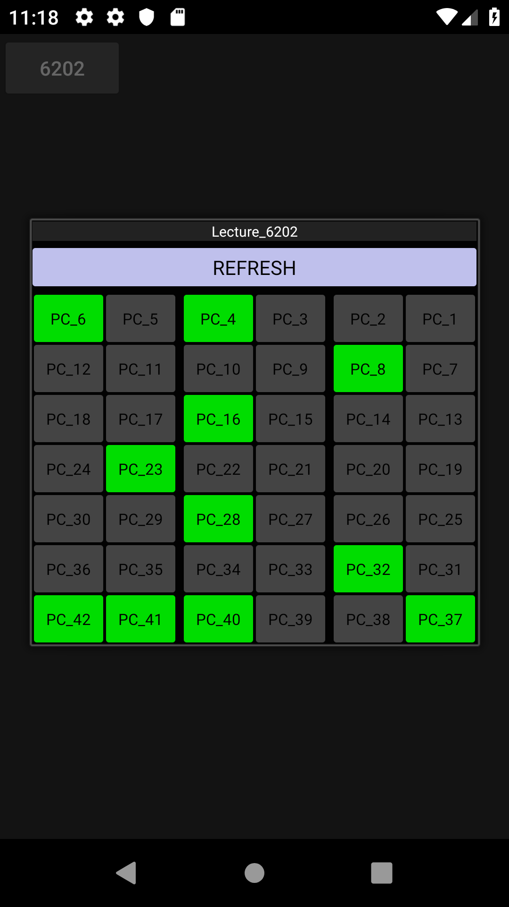

# PHP_Stud_App00


* * *
  - __19-01-05 00:53 프로젝트 데이터베이스-안드로이드 연동 성공- 콘솔 출력 성공- 레이아웃에 resultSet add 후 출력 성공.__
  - __19-01-17 23:41~__
  - __~19-01-18 00:42__
    - 기존 프로젝트 시연까지의 과정 새롭게 구현. Node.js 사용한 부분 php 활용한 json 인코딩, 디코딩 파싱 연습.
    - 레이아웃 등 부가적 구성 이외의 실질적 어플리케이션 기능 구현 완료.
  - __19-01-21 05:00__ 기존 기능 전체 재구현. 리프레시 기능 추가 구현 과정에서 스레드 조작에 난항.
<details><summary>재구현 중점</summary><div markdown="1">

|문제점|해결방식|
|--|--|
|자바 코드에서 생성된 버튼 조작 어려움|xml에서 버튼 생성-자바 코드에서 R, R.id 활용해 버튼 정의 후 조작|
|새로고침 기능 부적절|데이터 커넥팅 스레드로 구현, 스레드 활용한 새로고침 기능 구현---스레드 실행, 정지 기능 활용 미흡|
```java
for (; i > 36; i--) {
            Button b = new Button(this);
            b.setText("" + i);
            b.setId(i);
            b.setTextSize(10);
            LinearLayout.LayoutParams params = new LinearLayout.LayoutParams(70, LinearLayout.LayoutParams.WRAP_CONTENT);
            params.setMargins(2, 2, 2, 2);
            b.setLayoutParams(params);
            intent=new Intent(this,activity_desktop.class);
            b.setOnClickListener(new View.OnClickListener() {
                @Override
                public void onClick(View v) {
                    startActivityForResult(intent,1);
                }
            });
            layout8.addView(b);
            if (i % 2 == 1) {
                TextView t = new TextView((this));
                layout8.addView(t);
            }
            btnarray[btncount] = b;
            pcstatus(btnarray[btncount], status[btncount]);
            btncount++;
            b.setGravity(1);
        }
```
총 42개의 버튼 , 분단 구별을 위한 공백 텍스트뷰 혹은 Margin값 생성.

__재구현 코드__
```html
<Button
                android:id="@+id/pc6"
                android:layout_width="15pt"
                android:layout_height="wrap_content"
                android:text="pc_6"
                android:layout_weight="1"
                android:textSize="5pt"/>
```
```java
for(;i<42;i++) {
            pcA[i]=(Button)findViewById(pcId[i]);
            statusA[i]=Integer.parseInt(s[i+1]);
            pcstatus(pcA[i],statusA[i]);
            pcA[i].setOnClickListener(new View.OnClickListener() {
                final int j=i;
                @Override
                public void onClick(View v) {
                    intent.putExtra("pc_Number",pcA[j].getText());
                    startActivityForResult(intent, 1);
                }
            });
        }
```
__변환 필요점__
```java
int i;
/
/
/
i=0;
        for(;i<42;i++) {
            pcA[i].setOnClickListener(new View.OnClickListener() {
                @Override
                public void onClick(View v) {
                    intent.putExtra("pc_Number",pcA[i].getText());
                    startActivityForResult(intent, 1);
                }
            });
        }
해당 코드의 문제는 onClickListener의 정의에 사용한 i로 인해 발생. 

"Variable '...' is accessed from within inner class, needs to be declared final"
런타임 에러를 회피하기 위해 outer class 변수 i 사용, 위와 같은 코드로
pcA 배열 버튼들의 onClickListener를 정의한 경우 모든 pcA 배열 버튼들은
클릭 이벤트가 발생할 경우 현재 i의 값을 호출해 이벤트 처리.
위의 코드를 실행할 경우 i의 값은 42.
이 경우 모든 pcA 배열의 버튼들은 클릭될 경우 pcA[42].getText()를 실행하게 됨.

sol 1-외부 메소드 활용
public void popUpClick(Button b) {
        b.setOnClickListener(new View.OnClickListener() {
            @Override
            public void onClick(View v) {
                intent.putExtra("pc_Number",b.getText());
                startActivityForResult(intent, 1);
            }
        });
    }
과 같이 개별 버튼이나 버튼 배열을 메소드 매개변수로 보내 온클릭리스너 정의

sol 2-각각 새로운 final 변수 활용
for(;i<42;i++) {
            pcA[i]=(Button)findViewById(pcId[i]);
            statusA[i]=Integer.parseInt(s[i+1]);
            pcstatus(pcA[i],statusA[i]);
            pcA[i].setOnClickListener(new View.OnClickListener() {
                final int j=i;
                @Override
                public void onClick(View v) {
                    intent.putExtra("pc_Number",pcA[j].getText());
                    startActivityForResult(intent, 1);
                }
            });
        }
        
/*등 다양한 시도를 해봤지만 실패. 간단한 해답이 있을듯도 하지만 현재로썬
각 버튼들에 각자의 온클릭리스너를 정의해주는 방법밖엔 없는듯*/
헛지랄이였고 코드 잘못써서 안된거.
sol 2 방법으로 구현.
__버튼을 this로 삼는 리스너 정의?__ inner와 outter 개념을 제대로 알아둬야 
```
</div>
</details>
<details><summary>참고 자료</summary>
  
  - [버튼 클릭이벤트 재구현](http://jizard.tistory.com/9) , [버튼 클릭이벤트 재구현2](https://medium.com/@henen/%EB%B9%A0%EB%A5%B4%EA%B2%8C-%EB%B0%B0%EC%9A%B0%EB%8A%94-%EC%95%88%EB%93%9C%EB%A1%9C%EC%9D%B4%EB%93%9C-clickevent%EB%A5%BC-%EB%A7%8C%EB%93%9C%EB%8A%94-3%EA%B0%80%EC%A7%80-%EB%B0%A9%EB%B2%95-annoymous-class-%EC%9D%B5%EB%AA%85-%ED%81%B4%EB%9E%98%EC%8A%A4-implements-1b1fbe1a74c0)
  
  
  - __[Reflection 활용한 메소드 가져오기](http://www.mkyong.com/java/how-to-use-reflection-to-call-java-method-at-runtime/),[필드 조작에 사용](https://code.i-harness.com/ko-kr/q/cc780b),[문법 참](http://darkhorizon.tistory.com/290)__

  - [스레드 조작](https://code.i-harness.com/ko-kr/q/1cb672)
  
  - [레이아웃 스타일 활용](http://itpangpang.xyz/289) 이외에도 직접 만든 스타일 개별 적용이나 테마 짜집기 시도해봤으나 실패.
  
  - [인텐트, 액티비티 추가](http://whatisthenext.tistory.com/64) , [인텐트 데이터 전송](https://lx5475.github.io/2016/01/27/android-intent/)

  </ditails>
<details><summary>오류 목록</summary>
  
  __Application Installation Failed-__
  
  Installation failed with message Failed to establish session.
  
  It is possible that this issue is resolved by uninstalling an existing version of the apk 
  
  if it is present, and then re-installing.
  
  WARNING: Uninstalling will remove the application data!

__Solve-__ _http://codedragon.tistory.com/7837_

Step 1: 디바이스 종료

Step 2: AndroidStduio에서 아래와 같이 수행합니다.

메뉴: [Build] >> [Clean Project] >>

메뉴: [Build] >> [ReBuild Project] >>

메뉴: [Build] >> [Build APK(s)] >>

Run

</details>
</details>


  - __19-01-22 05:24~ 기능 추가와 기능 개편, 개발 진행과 더불어 개발능력 향상 시도.__
<details><summary>개발 진행</summary><div markdown="1">
  
  |문제점|해결|
  |--|--|
  |새로고침 기능 부적절|데이터 커넥팅 스레드로 구현, 스레드 활용한 새로고침 기능 구현---스레드 실행, 정지 기능 활용 미흡|
  |새로고침 기능 구현에 레이아웃 실행시 생성된 스레드 재사용 시도|새로고침 버튼이 클릭될 시 새로운 URLConnector 생성 후 start하도록--- 성공.|
  ```java
  btn6202.setOnClickListener(new View.OnClickListener() {
            @Override
            public void onClick(View v) {
                i=0;
                URLConnector task = new URLConnector(test);
                task.start();
                try {
                    task.join();
                    System.out.println("waiting... for result");
                } catch (InterruptedException e) {
                    e.printStackTrace();
                }
                String result = task.getResult();
                System.out.println(result);
                task.interrupt();
                String[] s;
                s=result.trim().split("");
                for(;i<42;i++) {
                    statusA[i] = Integer.parseInt(s[i + 1]);
                    pcstatus(pcA[i], statusA[i]);
                }
            }
        });
  ```
  ~ 6:48 현재시간 표기, 갱신 레이아웃 구현 시도(스레드 활용)--- 실패. _handler 사용이 필요한 구현인 듯_
  
  기본 코드 - [현재 시간 출력하기](https://medium.com/@peteryun/android-how-to-print-current-date-and-time-in-java-45b884917c6f)
  
  갱신 시도(스레드, while문 사용) - [스레드 종료](http://www.masterqna.com/android/35826/%EC%95%88%EB%93%9C%EB%A1%9C%EC%9D%B4%EB%93%9C-%EC%8A%A4%EB%A0%88%EB%93%9C-%EC%A2%85%EB%A3%8C-%EC%A7%88%EB%AC%B8)
  
  스레드와 반복문을 사용해 갱신되는 시계 구현 성공, 액티비티 재실행 시 스레드 충돌로 예상되는 오류 발생. _handler_
  
  "java.lang.NullPointerException: Attempt to invoke virtual method 'int android.text.Layout.getLineCount()' on a null object reference
        at android.widget.TextView.onMeasure(TextView.java:8628) ....."
  
  ```java
  Date dt = new Date();
    Log.d("DATE",dt.toString());

    SimpleDateFormat full_sdf = new SimpleDateFormat("yyyy-MM-dd, hh:mm:ss a");
    Log.d("DATE",full_sdf.format(dt).toString());

    SimpleDateFormat sdf = new SimpleDateFormat("hh");
    Log.d("DATE",sdf.format(dt).toString()+"시");
    class setDate extends Thread {
        @Override
        public void run() {
            while (!close) {
                dt = new Date();
                now.setText(full_sdf.format(dt).toString());
            }
        }
    }
  ```
   
  웹상 솔루션 활용해 해결 - [Thread + Handler로 현재 시간을 갱신하여 보여주기](http://blog.naver.com/PostView.nhn?blogId=bho7982&logNo=220908514907&parentCategoryNo=&categoryNo=106&viewDate=&isShowPopularPosts=false&from=postView)
  
  ~ 7:49 레이아웃 가시성, 편의성 향상--- drawable , onTouchListener 활용.
  
  - [android 커스텀 xml 둥근버튼 만들기](https://commin.tistory.com/25) , 
  - [버튼 이외 위젯에 클릭효과 구현](https://www.androidpub.com/1596818) , 
  - [버튼 스타일 적용 및 컨트롤](https://m.blog.naver.com/PostView.nhn?blogId=sangrime&logNo=220596277712&proxyReferer=https%3A%2F%2Fwww.google.com%2F) , 
  - [색상, 그라데이션, 테두리, 스타일, 이미지 버튼, 가장자리를 둥글게 만들기](https://withcoding.com/20) , 
  - [안드로이드 이벤트 : 버튼 클릭,롱클릭, 터치](https://bitsoul.tistory.com/13) , 
  - [Java 액티비티에서 Drawable 설정](https://choipandes.kr/23)
  -  
  </details>
