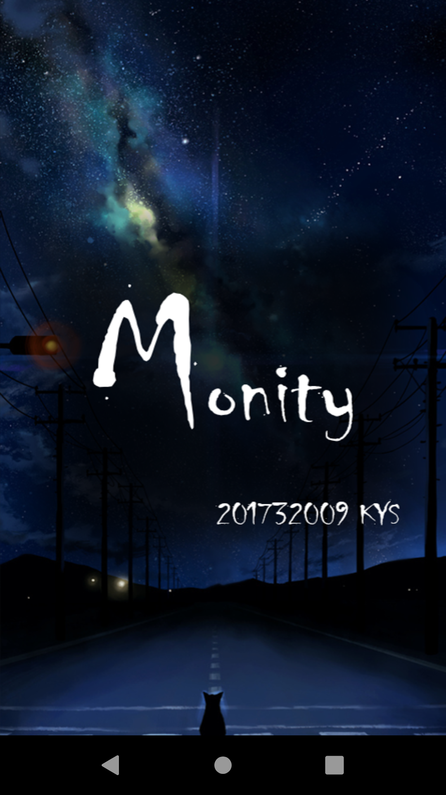
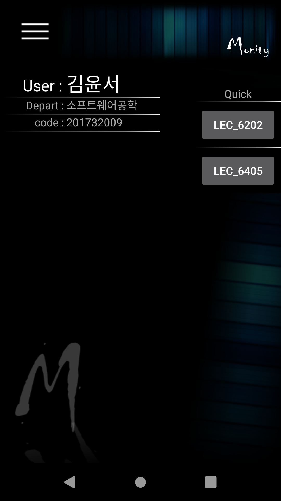
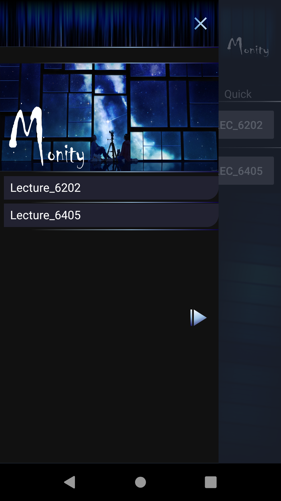
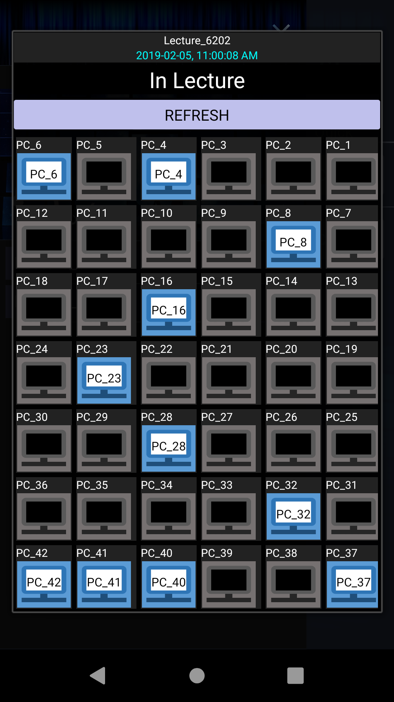
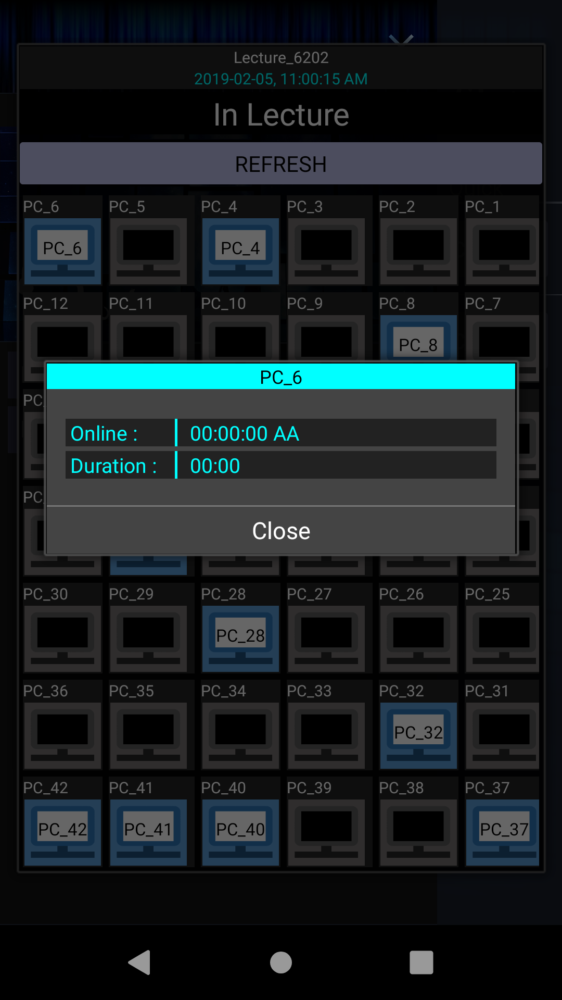
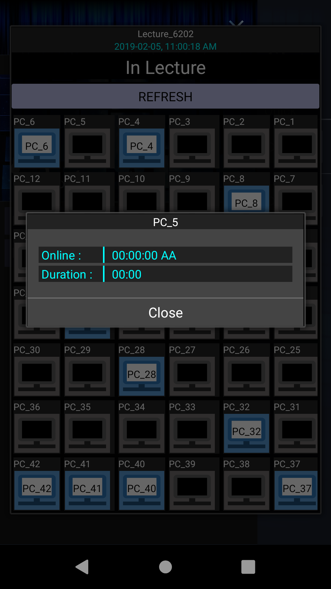

* * *

|   **Name**    |                                                                                       &nbsp;&nbsp;&nbsp;&nbsp;&nbsp;&nbsp;&nbsp;&nbsp;&nbsp;&nbsp; 김윤서 &nbsp;&nbsp;&nbsp;&nbsp;&nbsp;&nbsp;&nbsp;&nbsp;&nbsp;&nbsp;                                                                                       |                                    &nbsp;&nbsp;&nbsp;&nbsp;&nbsp;&nbsp;&nbsp;&nbsp;&nbsp;&nbsp; 박현렬 &nbsp;&nbsp;&nbsp;&nbsp;&nbsp;&nbsp;&nbsp;&nbsp;&nbsp;&nbsp;                                     | &nbsp;&nbsp;&nbsp;&nbsp;&nbsp;&nbsp;&nbsp;&nbsp;&nbsp;&nbsp; `Dropout` &nbsp;&nbsp;&nbsp;&nbsp;&nbsp;&nbsp;&nbsp;&nbsp;&nbsp;&nbsp; |
|:-------------:|:---------------------------------------------------------------------------------------------------------------------------------------------------------------------------------------------------------------------------------------------------------------------------------------------------------:|:----------------------------------------------------------------------------------------------------------------------------------------------------------------------------------------------------:|:-----------------------------------------------------------------------------------------------------------------------------------:|
| **GitHub_ID** |                                                                                                                                      [nn98](https://github.com/nn98)                                                                                                                                      |                                                                             [devpark435](https://github.com/devpark435)                                                                              |                                                                  -                                                                  |
|   **Role**    |                                                                                                                    **Lead** / __FULL__   _Mobile Client_ ,   _Server_ , Database                                                                                                                    |                                                                      __FE__   _Project planning_ ,   _Client_ , _Design_                                                                      |                                                   __FE__   _Mobile Client UI_                                                    |
|   **Stack**   |      |   |                                   |

* * *

### 강의실 빈자리 모니터링 서비스

#### 성공회대 컴퓨터 실습실의 현재 상태를 모니터링하고, 관련 정보를 제공합니다.

* * * 

Project Overview

  
  
  
  
  
  

